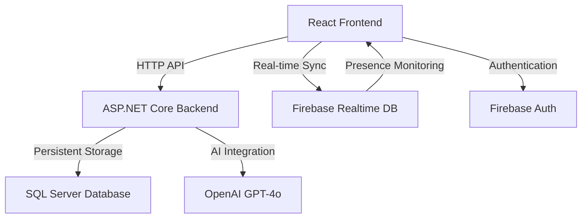

# Codenames Game - Advanced Real-time Multiplayer Web Application

A sophisticated, feature-rich digital implementation of the popular board game **Codenames**, built with modern web technologies and professional-grade architecture. This project showcases advanced real-time multiplayer functionality, AI integration, comprehensive analytics, and social gaming features.

> ⚠️ **Disclaimer**  
This project was created as part of a student assignment for educational purposes only.  
It demonstrates the gameplay mechanics and logic of the original **Codenames** board game.

All intellectual property rights to the original Codenames game are fully owned by **Czech Games Edition**.  
© 2025 Czech Games Edition. All rights reserved.  
No copyright infringement is intended.

### Main Lobby

The home screen where players can start a new game or join an existing one using a game code. Features a clean, spy-themed interface with Hebrew language support.

### Friends Management

Manage your friends list with options to search for users, send/accept friend requests, message friends, and invite them to games. Shows online status and member-since dates.

### Game Lobby

Pre-game setup room where players join teams (Red/Blue), configure AI spymasters with custom behavior prompts, select game mode (Scientific or Regular Hebrew), and invite friends before starting.

### Gameplay - Hebrew Mode

Active gameplay with the classic 5x5 word grid in Hebrew. Shows team panels with player roles, revealed cards with color-coded results, turn indicator, timer, and the clue/guess history chat panel.

### Gameplay - English/Scientific Mode

English word mode with the "Graphic Analysis" button for accessing word embedding analytics. Same core gameplay with team panels and clue system, designed for scientific analysis features.

### Word Embedding Analysis

Advanced analytics modal showing PCA-based scatter plot visualization of word similarities to a given clue. Displays cosine similarity and Euclidean distance metrics for each word, helping players understand semantic relationships.

## Table of Contents
- [Key Features](#key-features)
- [Technology Stack](#technology-stack)
- [Architecture](#architecture)
- [Project Structure](#project-structure)
- [Getting Started](#getting-started)
- [Game Modes](#game-modes)
- [AI Integration](#ai-integration)
- [Analytics & Statistics](#analytics--statistics)
- [Social Features](#social-features)
- [Audio System](#audio-system)
- [Development](#development)
- [API Documentation](#api-documentation)
- [Contributing](#contributing)
- [License](#license)

## Key Features

### **Core Gameplay**
- **Real-time Multiplayer**: Instant synchronization across all players using Firebase Realtime Database
- **Classic Codenames Rules**: Complete implementation with 5x5 word grid, team-based strategy
- **Hebrew & English Support**: Bilingual gameplay with RTL support for Hebrew
- **Turn-based Intelligence**: Strategic clue giving and word guessing mechanics
- **Team Management**: Red vs Blue teams with Spymaster and Operative roles

### **Advanced AI Integration**
- **OpenAI GPT-4o**: State-of-the-art AI for intelligent gameplay
- **Custom AI Personalities**: User-defined AI behavior and themes
- **Bidirectional AI Replacement**: Seamless human ↔ AI substitution during disconnections
- **Smart Clue Generation**: Context-aware clue creation with difficulty analysis
- **Anti-Loop Protection**: Sophisticated state tracking prevents infinite operations

### **Advanced Analytics**
- **Word Embedding Analysis**: OpenAI text-embedding-3-small for semantic analysis
- **Interactive Visualizations**: Chart.js scatter plots with similarity metrics
- **Real-time Performance Tracking**: Live gameplay analytics and statistics
- **PCA Dimensionality Reduction**: Mathematical analysis using MathNet.Numerics
- **Game History**: Comprehensive tracking of all gameplay interactions

### **Social Features**
- **Global Chat System**: Facebook Messenger-style floating chat
- **WhatsApp-style Bubbles**: Modern message interface with real-time delivery
- **Friends Management**: Add friends, send invitations, track online status
- **Game Invitations**: Direct invites to friends with toast notifications
- **Online Presence**: Real-time indicators showing who's online and in-game
- **Rematch System**: Vote-based rematch functionality after games

### **Professional Audio System**
- **14 Sound Effects**: Complete audio feedback for all game interactions
- **Smart Audio Service**: Automatic detection and loading from multiple file paths
- **User Controls**: Volume adjustment and enable/disable options
- **Contextual Audio**: Different sounds based on game state and actions

### **Technical Excellence**
- **Dual-Write Architecture**: SQL Server + Firebase for optimal performance
- **Automatic Reconnection**: Seamless recovery from network interruptions
- **Responsive Design**: Optimized for desktop, tablet, and mobile devices
- **Performance Optimized**: React.memo, useCallback, and efficient state management

## Technology Stack

### **Frontend Technologies**
| Technology | Version | Purpose |
|------------|---------|---------|
| **React** | 19.0.0 | Modern UI framework with concurrent features |
| **Vite** | 6.2.0 | Next-generation build tool with HMR |
| **Tailwind CSS** | 3.4.17 | Primary styling framework (utility-first CSS) |
| **Framer Motion** | 12.23.3 | Advanced animations and transitions |
| **Lucide React** | 0.513.0 | Icon library |
| **Chart.js** | 4.5.0 | Interactive data visualization |
| **Firebase** | 11.10.0 | Real-time database and authentication |
| **React Router** | 7.2.0 | Client-side routing |
| **Axios** | 1.8.4 | HTTP client for API communication |
| **React Toastify** | 11.0.5 | Toast notifications |

### **Backend Technologies**
| Technology | Version | Purpose |
|------------|---------|---------|
| **ASP.NET Core** | 6.0 | Cross-platform web API framework |
| **SQL Server** | Latest | Primary database for persistent storage |
| **OpenAI API** | GPT-4o | AI integration for intelligent gameplay |
| **MathNet.Numerics** | 5.0.0 | Mathematical computations and analytics |
| **Accord.Statistics** | 3.8.0 | Statistical analysis and data processing |
| **Swashbuckle** | Latest | API documentation and testing interface |
| **Newtonsoft.Json** | 13.0.3 | JSON serialization and processing |

### **External Services**
- **Firebase Realtime Database**: Real-time synchronization across clients
- **Firebase Authentication**: Secure user management and sessions
- **OpenAI GPT-4o**: AI clue generation and strategic gameplay
- **Firebase Presence**: Real-time connection monitoring

## Architecture

### **System Architecture Overview**
The application implements a sophisticated **Dual-Write Architecture**:

1. **SQL Server**: Primary persistent storage for game data, user statistics, and complex queries
2. **Firebase Realtime Database**: Real-time synchronization for instant UI updates across all clients



### **Data Flow Pattern**
```
User Action → React Component → Firebase (Real-time) + API Call (Persistent) → All Clients Updated
```

## Project Structure

```
/
├── client-codename/                   # React Frontend Application
│   ├── src/
│   │   ├── components/                # Organized React Components
│   │   │   ├── Analytics/             # Game analysis and statistics
│   │   │   ├── Auth/                  # Authentication components
│   │   │   ├── Chat/                  # Global chat system
│   │   │   ├── FriendsComps/          # Friends management
│   │   │   ├── Game/                  # Core game components
│   │   │   │   ├── Board.jsx          # Interactive game board
│   │   │   │   ├── Card.jsx           # Individual card component
│   │   │   │   ├── TeamPanel.jsx      # Team management with status
│   │   │   │   ├── CluePanel.jsx      # Clue giving interface
│   │   │   │   └── ClueChat.jsx       # In-game chat with smart scrolling
│   │   │   ├── Sound/                 # Audio system components
│   │   │   └── UI/                    # General UI components
│   │   ├── pages/                     # Main Application Pages
│   │   │   ├── Game.jsx               # Main gameplay interface
│   │   │   ├── GameLobby.jsx          # Pre-game lobby and setup
│   │   │   ├── Home.jsx               # Landing page
│   │   │   └── Friends.jsx            # Friends management page
│   │   ├── services/                  # Business Logic Services
│   │   │   ├── firebaseService.js     # Firebase operations
│   │   │   ├── aiService.js           # AI integration services
│   │   │   ├── authService.js         # Authentication logic
│   │   │   ├── soundService.js        # Audio management
│   │   │   └── gameService.js         # Core game logic
│   │   ├── context/                   # React Context Providers
│   │   │   ├── AuthContext.jsx        # Authentication state management
│   │   │   └── ChatContext.jsx        # Global chat state management
│   │   ├── hooks/                     # Custom React Hooks
│   │   ├── css/                       # Stylesheets and themes
│   │   └── assets/                    # Images and static resources
│   ├── firebaseConfig.js              # Firebase configuration
│   ├── package.json                   # Dependencies and scripts
│   ├── vite.config.js                 # Vite build configuration
│   └── tailwind.config.js             # Tailwind CSS configuration
│
└── server_codenames/                  # ASP.NET Core Backend API
    ├── Controllers/                   # API Controllers
    │   ├── AIController.cs            # AI clue generation endpoints
    │   ├── GamesController.cs         # Game lifecycle management
    │   ├── PlayerInGamesController.cs # Player operations and AI replacement
    │   ├── FriendsController.cs       # Social features endpoints
    │   ├── StatsController.cs         # Analytics and statistics
    │   └── UsersController.cs         # User management endpoints
    ├── BL/                            # Business Logic Layer
    │   ├── Game.cs                    # Game entities and logic
    │   ├── PlayerInGame.cs            # Player management logic
    │   ├── Friends.cs                 # Social features logic
    │   └── Stats.cs                   # Analytics and statistics logic
    ├── DAL/                           # Data Access Layer
    │   └── DBservices.cs              # All database operations
    ├── appsettings.json               # Application configuration
    └── Program.cs                     # Application entry point
```

## Getting Started

### **Prerequisites**
Before you begin, ensure you have the following installed:
- **Node.js 18+** - JavaScript runtime environment
- **.NET 6 SDK** - Backend framework
- **SQL Server** - Database (Local instance or Azure)
- **Firebase Project** - For real-time features (create at [Firebase Console](https://console.firebase.google.com/))
- **OpenAI API Key** - For AI integration (get from [OpenAI Platform](https://platform.openai.com/))

### **Installation Steps**

#### **1. Clone the Repository**
```bash
git clone [your-repository-url]
cd CodenamesGame
```

#### **2. Frontend Setup**
```bash
cd client-codename
npm install                    # Install all dependencies
```

#### **3. Backend Setup**
```bash
cd ../server_codenames
dotnet restore                 # Restore NuGet packages
```

#### **4. Database Setup**
Create a SQL Server database and execute the required table creation scripts for:
- Users, Games, PlayerInGames, Cards, Turns, Clues, Moves, Friends, GameStats

#### **5. Configuration**

**Frontend Configuration:**
Create `firebaseConfig.js` in the `client-codename/` directory:
```javascript
export const firebaseConfig = {
  apiKey: "your-firebase-api-key",
  authDomain: "your-project.firebaseapp.com",
  databaseURL: "https://your-project-default-rtdb.firebaseio.com/",
  projectId: "your-project-id",
  storageBucket: "your-project.appspot.com",
  messagingSenderId: "your-sender-id",
  appId: "your-app-id"
};
```

**Backend Configuration:**
Update `appsettings.json` in the `server_codenames/` directory:
```json
{
  "ConnectionStrings": {
    "myProjDB": "Server=localhost;Database=CodenamesDB;Trusted_Connection=true;"
  },
  "OpenAI": {
    "ApiKey": "sk-your-openai-api-key"
  }
}
```

#### **6. Run the Application**

**Start Backend Server (Terminal 1):**
```bash
cd server_codenames
dotnet run                     # Runs on http://localhost:5150
```

**Start Frontend Development Server (Terminal 2):**
```bash
cd client-codename
npm run dev                    # Runs on http://localhost:5173
```

#### **7. Production Build**
```bash
# Frontend Production Build
cd client-codename
npm run build
npm run preview

# Backend Production Build
cd server_codenames
dotnet publish -c Release
```

## Game Modes

### **Classic Mode (Hebrew)**
- Traditional Codenames gameplay with Hebrew word sets
- Right-to-left (RTL) interface support
- Cultural adaptation for Hebrew-speaking players
- Standard 5x5 word grid with team assignments

### **Scientific Mode (English)**
- English words with advanced linguistic features
- Word embedding analysis using OpenAI's text-embedding-3-small
- Interactive similarity visualizations
- Mathematical analysis with PCA dimensionality reduction
- Performance analytics and strategic insights

## AI Integration

### **AI Capabilities**
- **Intelligent Spymasters**: Generate contextually relevant clues
- **Strategic Operatives**: Make calculated guesses based on clues
- **Custom Personalities**: User-defined AI behavior (e.g., "only use space-related terms")
- **Difficulty Adaptation**: AI adjusts to player skill levels
- **Learning from Context**: AI analyzes previous moves and game state

### **Automatic AI Replacement System**
1. **Disconnection Detection**: Firebase presence monitoring detects when players disconnect
2. **Seamless Replacement**: Instantly replaces disconnected players with AI
3. **Username Preservation**: Maintains original player names for returning users
4. **Bidirectional Flow**: Supports both human → AI and AI → human transitions
5. **Anti-Loop Protection**: Prevents infinite replacement cycles

### **AI Configuration Example**
```javascript
// Custom AI prompt for themed gameplay
{
  "aiPrompt": "You are a space-themed AI. Only give clues related to astronomy, space exploration, or celestial objects. Limit clues to 1-2 words maximum.",
  "difficulty": "medium",
  "personality": "scientific"
}
```

## Analytics & Statistics

### **Word Embedding Analysis**
- **Semantic Similarity**: Measures relationships between clues and words
- **Vector Space Visualization**: Interactive scatter plots showing word clusters
- **Performance Metrics**: Tracks clue effectiveness and player improvement
- **Real-time Analysis**: Live feedback during gameplay

### **Game Statistics**
- **Player Performance**: Win rates, accuracy scores, average game time
- **Team Dynamics**: Cooperation effectiveness between Spymasters and Operatives
- **AI vs Human**: Comparative analysis of AI and human player performance
- **Historical Trends**: Long-term player improvement tracking

### **Analytics Dashboard Features**
- Interactive Chart.js visualizations
- Exportable data for further analysis
- Real-time performance monitoring
- Comparative analytics across different game modes

## Social Features

### **Friends System**
- **Add/Remove Friends**: Comprehensive friend management
- **Online Status**: Real-time presence indicators
- **Game Invitations**: Direct invites with push notifications
- **Friend Activity**: See what games friends are currently playing

### **Global Chat System**
- **Facebook Messenger Style**: Floating chat accessible from anywhere
- **WhatsApp-like Interface**: Modern message bubbles with proper alignment
- **Multiple Conversations**: Handle multiple chat windows simultaneously
- **Real-time Delivery**: Instant message synchronization
- **Online/Offline Indicators**: Know when friends are available

### **Social Features**
- **Tournament System**: Organized competitive play (planned feature)
- **Achievement System**: Track player progression and milestones
- **Spectator Mode**: Watch ongoing games as an observer
- **Game History**: Review past games with friends

## Audio System

### **Professional Audio Implementation**
- **14 Unique Sound Effects**: Complete audio feedback system
- **Smart File Detection**: Automatically finds and loads sounds from multiple paths
- **Audio Categories**:
  - Card interaction sounds (click, reveal, select)
  - Game event sounds (win, lose, turn change)
  - UI feedback sounds (button clicks, notifications)
  - Social interaction sounds (friend online, chat message)

### **Audio Controls**
- **Volume Control**: Adjustable volume slider (0-100%)
- **Enable/Disable**: Toggle all sounds on/off
- **Sound Preview**: Test audio levels in settings
- **Contextual Audio**: Different sounds based on game state

### **Audio File Management**
```javascript
// Smart audio service automatically detects files from:
// - /sounds/ directory
// - /public/sounds/ directory  
// - /assets/sounds/ directory
// Supports: .mp3, .wav, .ogg formats
```

## Development

### **Development Commands**

**Frontend Development:**
```bash
cd client-codename
npm run dev          # Start development server with HMR
npm run build        # Create production build
npm run preview      # Preview production build locally
npm run lint         # Run ESLint for code quality
```

**Backend Development:**
```bash
cd server_codenames
dotnet run           # Start development server with hot reload
dotnet build         # Build the project
dotnet test          # Run unit tests (if available)
dotnet publish -c Release    # Create production build
```

### **Code Quality & Standards**
- **ESLint Configuration**: Enforces consistent code style
- **React Best Practices**: Functional components with hooks
- **Clean Architecture**: Separation of concerns in backend
- **Error Handling**: Comprehensive try-catch blocks with user-friendly messages
- **Performance Optimization**: React.memo, useCallback for expensive operations

### **Development Best Practices**
1. **Component Organization**: Group related components by functionality
2. **Service Layer**: Centralized API and Firebase operations
3. **State Management**: Context API for global state, local state for components
4. **Error Boundaries**: Graceful error handling with user feedback
5. **Security**: Input validation, API rate limiting, secure authentication

## API Documentation

### **Core Game Endpoints**
```http
GET    /api/games                    # List available games
POST   /api/games                    # Create new game
GET    /api/games/{id}               # Get specific game details
PUT    /api/games/{id}               # Update game settings
DELETE /api/games/{id}               # Delete game

POST   /api/players/join             # Join existing game
POST   /api/players/leave            # Leave current game
POST   /api/players/kick             # Remove player from game
```

### **AI Integration Endpoints**
```http
POST   /api/ai/generate-clue         # Generate AI clue
POST   /api/ai/make-guess            # Make AI guess
POST   /api/ai/replace-player        # Replace disconnected player with AI
POST   /api/ai/remove-ai             # Remove AI and restore human player
```

### **Social Features Endpoints**
```http
GET    /api/friends                  # Get user's friends list
POST   /api/friends/add              # Send friend request
POST   /api/friends/accept           # Accept friend request
DELETE /api/friends/{id}             # Remove friend

POST   /api/invitations/send         # Send game invitation
GET    /api/invitations              # Get pending invitations
```

### **Analytics Endpoints**
```http
GET    /api/stats/player/{id}        # Get player statistics
GET    /api/stats/game/{id}          # Get game analytics
POST   /api/analytics/word-embedding # Perform word embedding analysis
GET    /api/analytics/performance    # Get performance metrics
```

### **Real-time Events (Firebase)**
- `game-updated` - Game state changes
- `player-joined` - New player joins game
- `player-left` - Player leaves game
- `clue-given` - New clue provided by Spymaster
- `card-revealed` - Card selected by team
- `turn-changed` - Turn switches to other team
- `game-ended` - Game finished with winner
- `chat-message` - New chat message received

## Contributing

This project was developed as part of a software engineering capstone project at **Ruppin Academic Center**. While primarily educational, we welcome contributions that enhance gameplay, fix bugs, or improve performance.

### **How to Contribute**
1. **Fork the Repository**: Create your own fork of the project
2. **Create Feature Branch**: `git checkout -b feature/amazing-feature`
3. **Make Changes**: Implement your feature or bug fix
4. **Test Thoroughly**: Ensure all functionality works correctly
5. **Commit Changes**: `git commit -m 'Add amazing feature'`
6. **Push to Branch**: `git push origin feature/amazing-feature`
7. **Open Pull Request**: Submit your changes for review

### **Contribution Guidelines**
- **Code Style**: Follow existing patterns and conventions
- **Documentation**: Update relevant documentation
- **Testing**: Test your changes thoroughly
- **Performance**: Consider impact on real-time synchronization
- **Security**: Ensure no security vulnerabilities are introduced

### **Areas for Contribution**
- New game modes or variations
- Enhanced AI capabilities
- Mobile responsiveness improvements
- UI/UX enhancements
- Performance optimizations
- Additional analytics features
- Internationalization (more languages)

## License

### **Academic Project**
This project was developed as part of the Software Engineering program at **Ruppin Academic Center** as a capstone project demonstrating:
- Real-time web application development
- AI integration and natural language processing
- Advanced data visualization and analytics
- Scalable system architecture
- Professional software development practices

### **Game Concept**
Based on the original **Codenames** board game by **Vlaada Chvátil**, published by **Czech Games Edition**. This digital implementation is created for educational purposes and demonstrates technical capabilities.

### **External Services & Libraries**
- **OpenAI**: GPT-4o API for AI intelligence
- **Firebase**: Real-time database and authentication services
- **Chart.js**: Data visualization library
- **Tailwind CSS**: Primary styling framework (used across 44 files)
- **Framer Motion**: Animation library for smooth transitions
- **Lucide React**: Icon library

---

## Project Highlights

### **Technical Achievements**
- Real-time Multiplayer: Seamless synchronization across multiple clients
- Advanced AI Integration: GPT-4o powered intelligent gameplay
- Dual-Write Architecture: Optimal performance with SQL + Firebase
- Professional Audio System: Complete sound design and management
- Comprehensive Analytics: Word embedding analysis and performance tracking
- Social Gaming Platform: Complete friends and chat system
- Responsive Design: Works perfectly across all device types
- Production Ready: Scalable architecture with error handling

### **Innovation Highlights**
1. **Bidirectional AI Replacement**: Unique seamless human ↔ AI substitution
2. **Word Embedding Analysis**: Advanced linguistic analysis for strategy insights
3. **Smart Audio System**: Intelligent sound file detection and management
4. **Global Chat Integration**: Facebook Messenger-style social features
5. **Custom AI Personalities**: User-defined AI behavior and themes
6. **Real-time Presence**: Advanced connection monitoring and status tracking

---

**Ready to experience the future of Codenames? Clone, configure, and start playing today!**

**Version**: 2.0.0 | **Status**: Production Ready | **Last Updated**: July 2025

Built with ❤️ by the Software Engineering Team at Ruppin Academic Center

---

> ⚠️ **Disclaimer**  
This project was created as part of a student assignment for educational purposes only.  
It demonstrates the gameplay mechanics and logic of the original **Codenames** board game.

All intellectual property rights to the original Codenames game are fully owned by **Czech Games Edition**.  
© 2025 Czech Games Edition. All rights reserved.  
No copyright infringement is intended.
